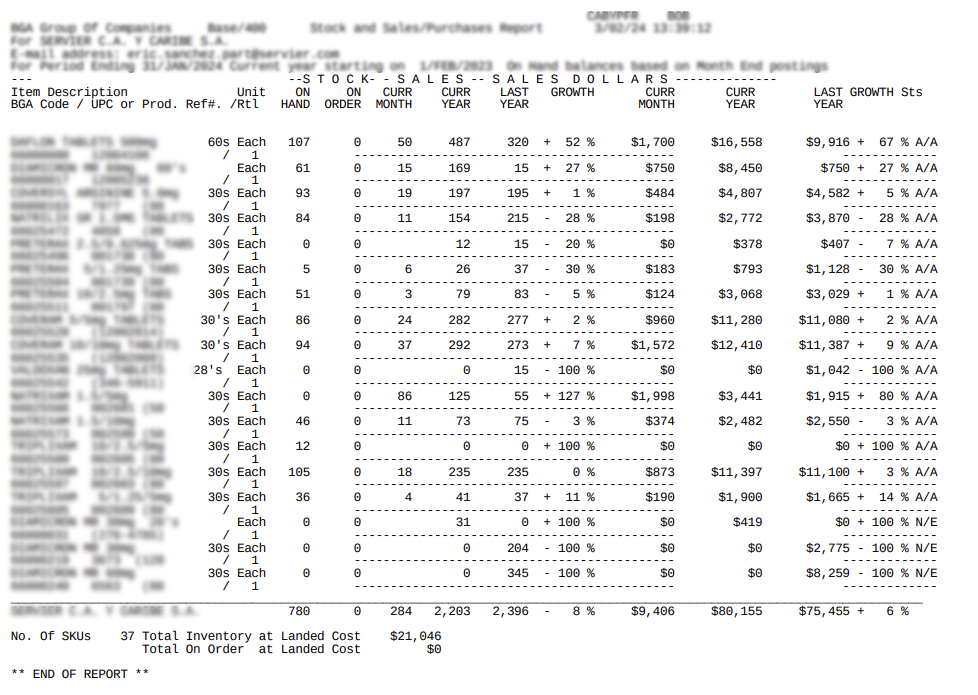

# Tutorial 7 - Data extraction from PDF

[View source on GitHub](https://github.com/RomualdRousseau/Any2Json-Examples).

This tutoral is a continuation of the [Tutorial 6](tutorial_6.md).

This tutorial will demonstrate how to use [Any2Json](https://github.com/RomualdRousseau/Any2Json) to extract data from
one PDF. The document is not well-formed and very noisy. To demonstrate the usage of this framework, we
will load a document with a somewhat complex layout, as seen here:



## Setup Any2Json

### Import the packages and setup the main class:

```java
package com.github.romualdrousseau.any2json.examples;

import java.util.EnumSet;
import java.util.List;

import com.github.romualdrousseau.any2json.Document;
import com.github.romualdrousseau.any2json.DocumentFactory;
import com.github.romualdrousseau.any2json.parser.LayexTableParser;

public class Tutorial7 implements Runnable {

    public Tutorial7() {
    }

    @Override
    public void run() {
        // Code will come here
    }

    public static void main(final String[] args) {
        new Tutorial7().run();
    }
}
```

### pom.xml

Any2Json has a very modular design where each functionality can be loaded separatly. We add the "any2json-net-classifier"
module to enable the tagging capabilities. This module use [TensorFlow](https://www.tensorflow.org/) for Java. The
following depedencies are required to run the code of this tutorial:

```xml
<!-- Any2Json Framework -->
<dependency>
    <groupId>com.github.romualdrousseau</groupId>
    <artifactId>any2json</artifactId>
    <version>${any2json.version}</version>
</dependency>
<dependency>
    <groupId>com.github.romualdrousseau</groupId>
    <artifactId>any2json-layex-parser</artifactId>
    <version>${any2json.version}</version>
</dependency>
<dependency>
    <groupId>com.github.romualdrousseau</groupId>
    <artifactId>any2json-net-classifier</artifactId>
    <version>${any2json.version}</version>
</dependency>
<dependency>
    <groupId>com.github.romualdrousseau</groupId>
    <artifactId>any2json-csv</artifactId>
    <version>${any2json.version}</version>
</dependency>
<dependency>
    <groupId>com.github.romualdrousseau</groupId>
    <artifactId>any2json-excel</artifactId>
    <version>${any2json.version}</version>
</dependency>
<dependency>
    <groupId>com.github.romualdrousseau</groupId>
    <artifactId>any2json-pdf</artifactId>
    <version>${any2json.version}</version>
</dependency>
```

## Load base model

To parse a document, any2Json needs a model that will contains the parameters required to the parsing. Instead to start
from an empty Model (See [Tutorial 10](tutorial_10.md)), we will start from an existing one and we will adapt it for our
document. You can find a list and details of all models [here](https://github.com/RomualdRousseau/Any2Json-Models/).

The base model, we will use, is "sales-english" that has been trained on 200+ english documents containing distributor
data and with a large range of different layouts.

The base model already recognize some entities such as DATE and NUMBER. We will configure a layex to extract the
different elements of the documents. You can find more details about layex [here](white_papers.md).

```java
final var model = Common.loadModelFromGitHub("sales-english");

// Add a layex to the model

final var tableParser = new LayexTableParser(
        List.of("(v.$)+"),
        List.of("(()(v.+$v.+$))(()(e.+$)+())(v.+$)"));
model.registerTableParser(tableParser);
```

### Load the document

We load the document by creating a document instance with the model. The hint "Document.Hint.INTELLI_LAYOUT" tells
the document instance that the document has a complex layout. WThe recipe "sheet.setCapillarityThreshold(0)" tells the
parser engine to extract the features as ***small*** as possible:

```java
final var file = Common.loadData("document with noises.pdf", this.getClass());
try (final var doc = DocumentFactory.createInstance(file, "UTF-8")
        .setModel(model)
        .setHints(EnumSet.of(Document.Hint.INTELLI_LAYOUT))
        .setRecipe(
            "sheet.setCapillarityThreshold(0)",
            "sheet.dropNullRows(0.45)")) {
    ...
}
```

### Output the tabular result

Finally, we iterate over the sheets, rows and cells and output the data on the console:

```java
doc.sheets().forEach(s -> Common.addSheetDebugger(s).getTable().ifPresent(t -> {
    Common.printHeaders(t.headers());
    Common.printRows(t.rows());
}));
```

```bash
2024-03-13 17:56:46 INFO  Common:43 - Loaded model: sales-english
2024-03-13 17:56:46 INFO  Common:60 - Loaded resource: /data/document with noises.pdf
2024-03-13 17:56:49 DEBUG Common:87 - Extracting features ...
2024-03-13 17:56:49 DEBUG Common:91 - Generating Layout Graph ...
2024-03-13 17:56:49 DEBUG Common:95 - Assembling Tabular Output ...
============================== DUMP GRAPH ===============================
document with noises
|- Item DescriptionUnit BGA Code / UPC or Prod. Ref#. /Rtl ON HAND ORDER MONTH ONCURRCURRLAST YEARYEAR GROWTHCURR MONTH CURRLAST GROWTH Sts YEARYEAR   DATA(0, 0, 6, 20, 21, 18) (1)
================================== END ==================================
2024-03-13 17:56:49 DEBUG Common:100 - Done.
Item Description        ON HAND ORDER MO        ONCURRCURRLAST Y        GROWTHCURR MONTH        CURRLAST GROWTH                         
XXXXXX XXXXXXX X                     107        050487320 + 52 %                  $1,700        $16,558$9,916 +                         
XXXXXXXXX XX XXm                      61         01516915 + 27 %                    $750        $8,450$750 + 27                         
XXXXXXXX XXXXXXX                      93             019197195 +                 1 %$484        $4,807$4,582 +5                         
XXXXXXXX XX XXXM                      84        011154215 - 28 %                    $198        $2,772$3,870 - 2                        
XXXXXXXX XXX/XXX                       0            01215 - 20 %                      $0        $378$407 -7 % A/                        
XXXXXXXX X/XXXXX                       5           062637 - 30 %                    $183        $793$1,128 - 30                         
XXXXXXXX XX/XXXX                      51                037983 -                 5 %$124        $3,068$3,029 +1                         
XXXXXXX X/XXXXXX                      86             024282277 +                 2 %$960        $11,280$11,080 +                        
XXXXXXX XX/XXXX                       94             037292273 +               7 %$1,572        $12,410$11,387 +                        
XXXXXXXX XXXX XX                       0            0015 - 100 %                      $0        $0$1,042 - 100 %                        
XXXXXXXX XXX/XXX                       0        08612555 + 127 %                  $1,998        $3,441$1,915 + 8                        
XXXXXXXX XXX/XXX                      46               0117375 -                 3 %$374        $2,482$2,550 -3                         
XXXXXXXXX XX/XXX                      12             000 + 100 %                      $0        $0$0 + 100 % A/A                        
XXXXXXXXX XX/XXX                     105               018235235                 0 %$873        $11,397$11,100 +                        
XXXXXXXXXXXXXXXX                      36           044137 + 11 %                    $190        $1,900$1,665 + 1                        
XXXXXXXXX XX XXX                       0            0310 + 100 %                      $0        $419$0 + 100 % N                        
XXXXXXXXX XX XXX                       0           00204 - 100 %                      $0        $0$2,775 - 100 %                        
XXXXXXXXX XX XXX                       0           00345 - 100 %                      $0        $0$8,259 - 100 %  
```

On this output, we print out the graph of the document built during the parsing and we can see clearly the relation
between the elements of the spreadsheet and how there are structured in tabular form.

## Conclusion

Congratulations! You have loaded documents using Any2Json.

For more examples of using Any2Json, check out the [tutorials](index.md).
